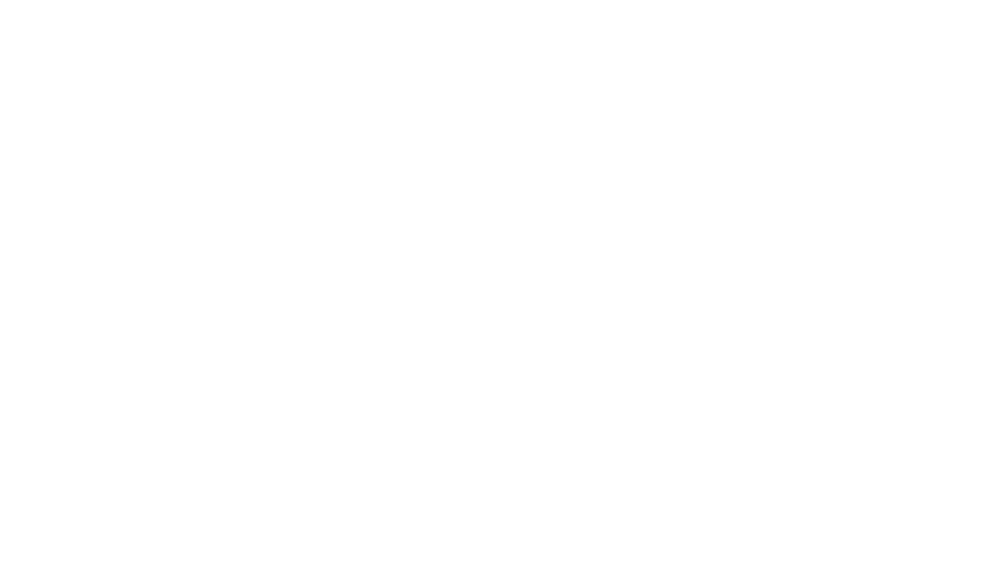
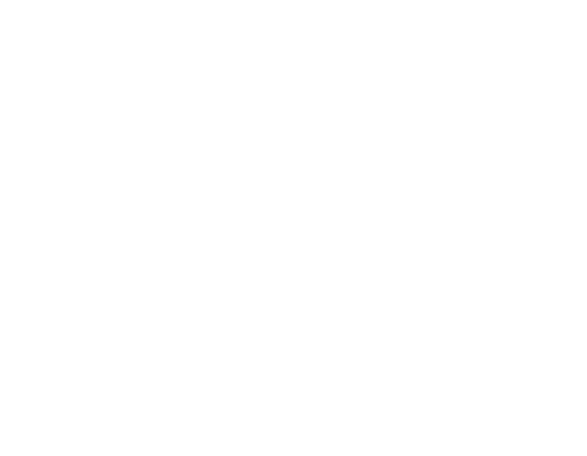
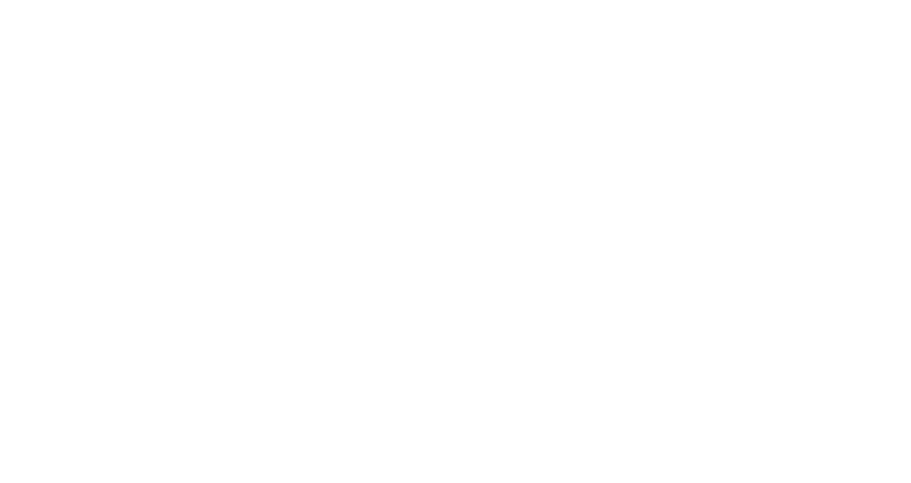
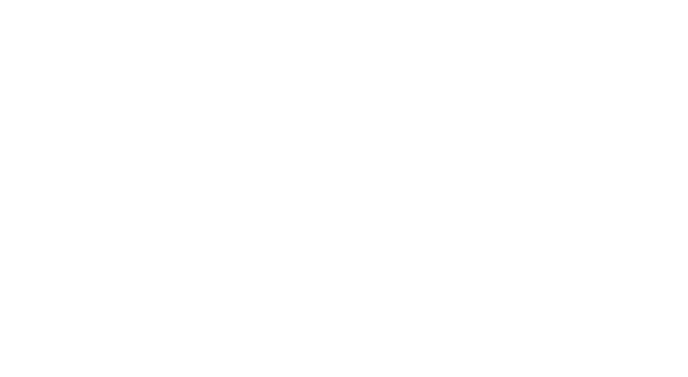

# Practical TypeScript

## ... how to make better mistakes

###### and why I don't handwrite more

---

# TypeScript

is a Microsoft-owned **superset** of Javascript.

---

Most* modern web frontend work is done via compiling standards
that don't yet exist in older browsers to cross-platform JavaScript.

\* citation needed

---



---

TypeScript provides a compiler that can handle standard JavaScript, and prepare it for older targets.

It also understands some of its own syntax to add compile-time checks.

---


---


---

Great solutions exist for using TypeScript in React applications
among other destinations.

Why do I like it so much?

---

### Reasons I like TypeScript:

# The compiler is smarter than me

---

```typescript
// using strict null checking...

function fooify(thing: string) {
  return thing.toUpperCase();
}

fooify(undefined);
//     ^^^^^^^^^
// [ts] Argument of type 'undefined' is not assignable
//      to parameter of type 'string'.
```

Can't pass an undefined to a string parameter.

---

```typescript
const stringOrFalse = (returnString: boolean) =>
  (returnString) ? "hi" : false;

const fooify = (thing: string) => thing.toUpperCase();
const value = stringOrFalse(true);

fooify(value);
//     ^^^^^
// [ts] Argument of type 'false | "hi"' is not
//      assignable to parameter of type 'string'.
// Type 'false' is not assignable to type 'string'.
```

Value could be `false`.

---

```typescript
const stringOrFalse = (returnString: boolean) =>
  (returnString) ? "hi" : false;

const fooify = (thing: string) => thing.toUpperCase();
const value = stringOrFalse(true);

if (value) {
  // value can't be 'false', so no error
  fooify(value);
}
```

Compiler is smart enough to find conditions that narrow a value.

---

```typescript
type Eel = string | 7;
type SwallowType = 'African' | 'European';

enum FavouriteColour {
  blue = '#0000ff',
  yellow = '#ffff00',
}

interface IHovercraft {
  contents: Eel[],
}
```

Most types are very flexible.

---

```typescript
interface IUser {
  name: string,
  isAdmin: boolean,
}

const addUser = (user: IUser) => true;

addUser({name: 'Jesse Doe', isAdmin: true});
```

Most types are picked up without needing to annotate them.

---

```typescript
addUser({name: 'Alex Nguyen'});
//      ^^^^^^^^^^^^^^^^^^^^^
// [ts] Argument of type '{ name: string; }' is not
//      assignable to parameter of type 'User'.
// Property 'isAdmin' is missing in type
//      '{ name: string; }'.
```

Error messages tell you why the type doesn't work here.

---

```typescript
interface IFeatureFlagList { [k: string]: boolean };

const makeFlagTester = (flags: IFeatureFlagList) =>
  (flag: keyof IFeatureFlagList) =>
    flags[flag];

const testFlag = makeFlagTester({
  hasBakedBeans: false,
  // error due to value
  invasiveTracking: 'always!',
  // error due to key
  true: false,
});
```

---

```typescript
interface IFeatureFlagList { [k: string]: boolean };

const makeFlagTester = (flags: IFeatureFlagList) =>
  (flag: keyof IFeatureFlagList) =>
    flags[flag];

const testFlag = makeFlagTester({});
// error: true can never be a key of
//        IFeatureFlagList
testFlag(true);
// error: boolean doesn't have `toUpperCase`
testFlag('gamification').toUpperCase();
```

---

### Reasons I like TypeScript:

# The community

---

Using types safely with untyped libraries involves manually writing extra declarations.

---

DefinitelyTyped is a community project that covers 4,924 external libraries, at time of writing.

---

```shell
yarn add react-router-dom
yarn add -D @types/react-router-dom
```

---

```typescript
declare module "markdown-it/lib/presets/commonmark" {
  import { Options } from 'markdown-it';

  export default Options;
}
```

Not particularly onerous to add missing types if necessary.

---

### Reasons I (sorta) like TypeScript:

# It's still JavaScript

---



---

Still no `?.` operator, for example.

---


---

Add TypeScript support now, migrate whenever you want.

Valid JavaScript is valid* TypeScript.

---

# Completely fair comparison

---



---



---

# Fin.

#### Liam Dawson   
### @liamdaws
